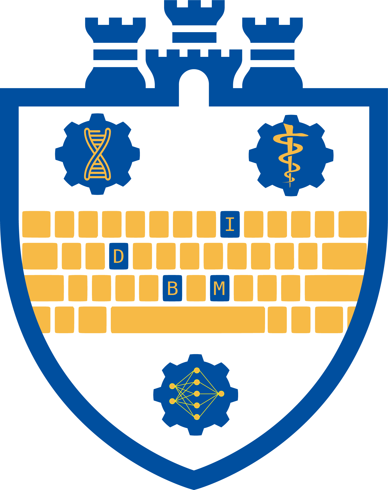

# DBMI Logo

This repository contains the SVG and PNG files for the Pitt DBMI Logo, providing open access for anyone to view and modify. The logo pays homage to the University of Pittsburgh shield, symbolizing the DBMI's place within the university. The shield and castle elements are reminiscent of the Pitt logo. The checkerboard design represents a computer keyboard, reflecting our focus on computational work. Unlike a traditional checkerboard, we have darkened specific keys to encode our name. The circles from the original Pitt logo have been transformed into gears, representing the core tenets and drivers of our department. These gears feature the Rod of Asclepius, symbolizing our dedication to advancing medicine; the DNA double helix, highlighting our pursuit of understanding biology and nature; and a multilayer perceptron/network, emphasizing our computational and systematic research approaches. Together, this logo tells the story of the DBMI. 

## Usage

The logo was developed using vector-based graphics. All files are saved as SVGs and can be edited with any program that supports vector graphics, including Adobe Illustrator, GIMP, and even Microsoft PowerPoint. To use it in PowerPoint, open a blank presentation, drag and drop an SVG onto a slide, right-click on the image, and select "Convert to Shape." If you do not wish to edit the image, you can simply download and use the provided PNG files. The PNG files are 1667×2103 pixels, which should be of high enough quality for most purposes. If you need a larger or higher resolution version, open the SVG file and export the image at your desired resolution.

This logo is intended for ***FREE*** use by the Pitt DBMI community. Please do not use this logo for any merchandising or profit-making purposes.

## Variations

There are several variations of the logo to suit different needs. These variations are described in the filenames. Some of the options include the base logo, the base logo with the keyboard letters highlighted, and the base logo with outlines for use on non-white backgrounds. See the examples below to view these variations.

## Acknowledgement
This logo was developed by Joy Roy with feedback from his fellow DBMI classmates for use in their presentations. If you have any concerns, especially legal ones, please disregard the previous statement. It was a joke. Joy had no involvement in its creation. In fact, Joy has visual impairments that would have prevented him from creating the logo. He is blind in his right eye and 70% blind in his left, so he couldn't have made this. Thank you.